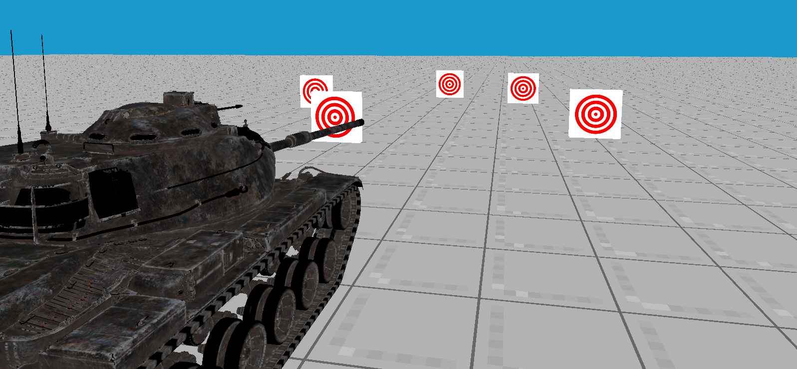

# CG/2 &nbsp; # Задание 2
Вводный курс компьютерной графики  
*Автор задания:* Александр Соболев

Сборка подробно описана в файле [README.md](../README.md)
Вркатце: устанавливаете библиотеки, создаете в корне папку `build`, заходите в неё, пишите один раз `cmake ..`, затем `make`. После того как внесли изменения, снова пишите `make`. Чтобы запустить приложение, пишите `./main`. В случае проблем с первоначальной сборкой, проверьте установленные библиотеки. Если ничего не помогает, спросите помощи у сверстников, либо создайте Issue на странице задания на GitHub (об этом ниже).

### Управление в шаблоне
`Escape` - Выход  
`ПКМ`    - Захват мыши  
`Мышь`   - Вращение камеры  
`WASD`   - Перемещение камеры  
`QZ`     - Вверх/вниз в мировых координатах  
`EC`     - Вверх/вниз в координатах камеры  
`F`   - Переключиться на танк и обратно  

___

## Базовая часть (15 баллов)

*Вам надо в срочном порядке (до засекречено) запустить танк на сверхсекретное задание. Мир надеется на вас, не подведите!*

Для начала скомпилируйте и запустите программу.
Сейчас она просто показывает пустой экран. Поскольку танки — удовольствие не дешёвое, мы сначала выведем на экран унылый, но зато очень дешёвый треугольник. Вам предстоит дописывать части уже написанной программы.

#### Задание (1 балл)
 Тут вам понадобятся: [MyGame.cpp](../src/MyGame.cpp), [triangle/fragment.glsl](../shaders/triangle/fragment.glsl), [triangle/vertex.glsl](../shaders/triangle/vertex.glsl).

 Добавьте вызов `triangle->Draw()` в метод `Draw` в [MyGame.cpp](../src/MyGame.cpp). Обратите внимание, что метод должен находиться в активной зоне шейдера `tri_sh` (в блоке с `ShaderZone(tri_sh)`)

 Скомпилируйте, запустите, вы должны увидеть следующее:

 

 Всё, что делает `triangle->Draw()` в данном случае это передает координаты точек треугольника  и еще некоторую геометрическую информацию) в используемый шейдер. (Вы можете посмотреть, что именно передается в создании примитива треугольника в [Primitives.cpp](../src/Primitives.cpp) в `CreateSimpleTriangleMesh`)

Взгляните на координаты вершин на картинке внизу.

 

Итак, координаты попадают в вершинный шейдер [triangle/vertex.glsl](../shaders/triangle/vertex.glsl). Напомню, что вершинный шейдер, это программа, которая выполняется для каждой вершины геометрического примитива. В нашем случае вершины всего 3: `(-1, 1, -0.5)`, `(-1, -1, -0.5)`, `(1, -1, -0.5)`. (третья координата пока не используется). Вершины попадают в переменную `vertex` с аттрибутом расположения `location=0`. (Это происходит потому что для позиций используется `glEnableVertexAttribArray(0)` в [Primitives.cpp](../src/Primitives.cpp))
`gl_Position` - это специальная переменная, куда записываются полученные значения спроецированных вершин. Сейчас туда, как вы видите, записываются координаты без модификации.  

`gl_Position` – ожидает координаты NDC Normalized Device Coordinates) – это координаты, где центр экрана считается  0,0), а углы соответствуют координатам нашего треугольника. Поэтому мы и получили такой результат.

После того, как все вершины будут обработаны вершинным шейдером OpenGL знает где он должен нарисовать каждый треугольник, остается только понять каким цветом его закрасить. Для каждого пикселя, который нам надо закрасить, вызывается фрагментный шейдер  файл `fragment.glsl`) Если вы посмотрите в [triangle/fragment.glsl](../shaders/triangle/fragment.glsl), то увидите, что там есть специальная переменная color, в которую наш код должен записать рассчитанный цвет пиксела. По-умолчанию RGB. Поэтому треугольник <b style="color:#FF00FF">фиолетовый</b> = <b style="color:#FF0000">красный</b> + <b style="color:#0000FF">синий</b>.

#### Задание (2 балла): Поменяйте фрагментный шейдер так, чтобы программа выводила зеленый треугольник цвета  0, 1, 0)
Отлично, зеленый треугольник уже куда больше походит на танк, но все же генералам нужен настоящий трехмерный танк! Давайте взглянем на то, как можно перейти от двумерных примитивов к трехмерным.

Для проецирования вершин на экран используют матричные операции над однородными координатами. Однородные координаты — это 3-ёх мерные координаты, где добавляется четвертая фиктивная. Это позволяет при помощи матричного умножения осуществлять не только масштабирование  Scale) и поворот  Rotation), но и движение  Translation).

 Справа на картинке представлена структура произвольного матричного преобразования в однородных координатах. Левая верхняя подматрица представляет собой трехмерную матрицу (Как в курсе линейной алгебры) и позволяет осуществлять повороты и масштабирование вершины на координаты которой мы умножили данную матрицу. Координаты выделенные черным цветом — это координаты переноса. На них умноженная вершина сдвинется после умножения. Нижнюю строку можно на данном этапе считать всегда равной (0, 0, 0, 1)

Следующие ссылки могут помочь лучше понять матрицы преобразования:  
- http://graphics.cs.cmu.edu/nsp/course/15-462/Spring04/slides/04-transform.pdf
- http://www.cs.cmu.edu/~16385/s17/Slides/11.1_Camera_matrix.pdf
- http://ksimek.github.io/2012/08/22/extrinsic/
- https://www.3dgep.com/understanding-the-view-matrix/
- http://ksimek.github.io/2013/08/13/intrinsic/

В нашем случае используется запись матрицы по столбцам, но в некоторых источниках можно встретить матрицу, записанную построчно. Проблема элементарно решается простым транспонированием, но самое главное, чтобы матрицы при перемножении всегда были в одном представлении.
Подробнее о разнице можно узнать [тут](https://www.scratchapixel.com/lessons/mathematics-physics-for-computer-graphics/geometry/row-major-vs-column-major-vector).

Посмотрите на картинку ниже. Там изображена виртуальная камера, которую мы хотим создать. Ее поле зрения — это усеченная пирамида. Значит, чтобы спроецировать трехмерную вершину на экран, нам нужно применить к ней преобразование, которое переводит пирамиду в единичный куб!

Почему единичный куб? Выше мы уже разобрались, что наш экран - это единичный квадрат `[-1, 1]x[-1, 1]`. Добавляя глубину, с помощью которой мы сортируем пиксели, он превращается в единичный куб.

Более подробно о преобразованиях:  
http://www.songho.ca/opengl/gl_transform.html

К счастью такая функция подсчитывающая такую матрицу уже существует.

`ProjectionMatrixTransposed(fov, aspect_ratio, near, far)`  
`fov` – горизонтальный угол обзора камеры  
`aspect_ratio` – соотношение ширины к высоте окна  
`near` – расстояние до ближней плоскости отсечения  
`far` – расстояние до дальней плоскости отсечения

#### Задание (3 балла)
Создайте в конструкторе [MyGame.cpp](../src/MyGame.cpp) матрицу projection с параметрами.  
`fov = 90` градусов  
`near = 0.1`  
`far = 1000`  
Если использовали `ProjectionMatrixTransposed`, не забудьте оттранспонировать матрицу.

В нашем случае матрица проекции используется во всех шейдерах, поэтому давайте будем её передавать во все шейдеры. Для этого после выставления шейдера (`shader->StartUseShader()`) в `ShaderZone`, пропишем выставление матрицы через `shader->SetUniform(name, matrix)` в качестве имени используем `"projection"`.

Результат выглядит так. Треугольник не влезает в экран!

Нам нужно добавить камеру, чтобы отлететь подальше!

#### Задание (5 баллов): Схожим образом передать матрицу view.

Все подсказки есть в файлах с пометкой `[HELP]`.

Щёлкните правой кнопкой мыши по экрану и обретите контроль! Вы всевластны над этим треугольником и можете рассмотреть его со всех сторон!

Но надо двигаться дальше, генералов не устраивает треугольник, они требуют танк!

#### Задание (9 баллов) Добавить больше объектов
Можете перестать рисовать треугольник, он нам больше не нужен. Но нам нужны другие объекты!

Добавьте в [MyGame.cpp](../src/MyGame.cpp) в методе `Draw()` недостающие методы отрисовки.

Вы должны увидеть полигон, мишени и белый непонятный танк, застрявший в земле.

Давайте сначала раскрасим его, а потом разберемся, почему он застрял в земле.

#### Задание (10 баллов) Раскрасить танк

Вам понадобится [tank/fragment.glsl](../shaders/tank/fragment.glsl).

Следуйте подсказкам и вы с легкостью разукрасите танк.

Немного о том, как у нас это получилось: наш танк состоит из кучи треугольников, каждому треугольнику соответствует свой треугольник в текстурных координатах.

Каждый пиксель знает свою позицию и позицию трёх вершин, что его окружают и их текстурные координаты. На основе этих данных он вычисляет "среднее" значение текстурной координаты (интерполирует текстурные координаты).

Теперь мы знаем, что проблема застрявшего танка не в текстурах. Так в чём же?

Дело в том, что мы рисуем все части танка в одной точке, в нулевой, поэтому они застревают в земле и друг в друге.

#### Задание (12 баллов): Добавить модельные преобразования
Вам понадобятся: Шейдер зона `tank_s` в [MyGame.cpp](../src/MyGame.cpp) и [tank/vertex.glsl](../shaders/tank/vertex.glsl). Все подсказки там.

Замечательно! У нас есть танк!

Пока генералы в восторге и не заметили, что танк не шевелится, давайте добавим ему вращением башни!

#### Задание (15 баллов): Добавить вращение башни

Вам понадобятся: Шейдер зона `tank_s` в [MyGame.cpp](../src/MyGame.cpp).
Все подсказки там!

Результат:

___

## Правила оценки

Todo
___

## Дополнительная часть

Todo

___

### Вопросы

В случае, если вы нашли ошибку в коде, опечатку или орфографическую ошибку, вы можете смело создать Issue или Pull requst на гитхабе в репозитории задания.  
https://github.com/Tirondzo/CG-2-2019-Task-2  
Если есть какие-то невероятные сложности, вы так же можете создать Issue.